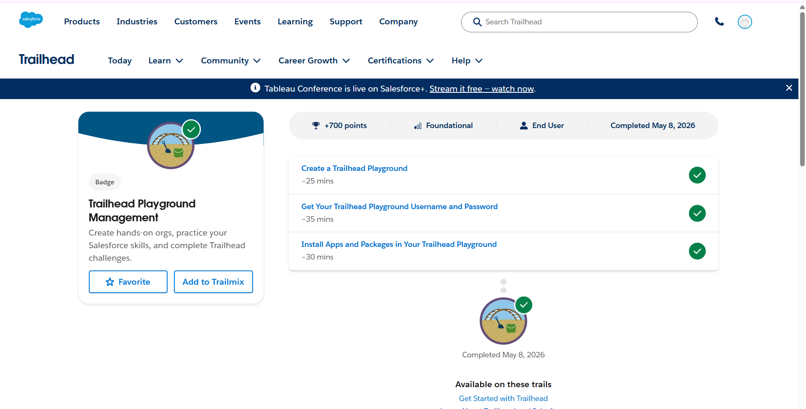
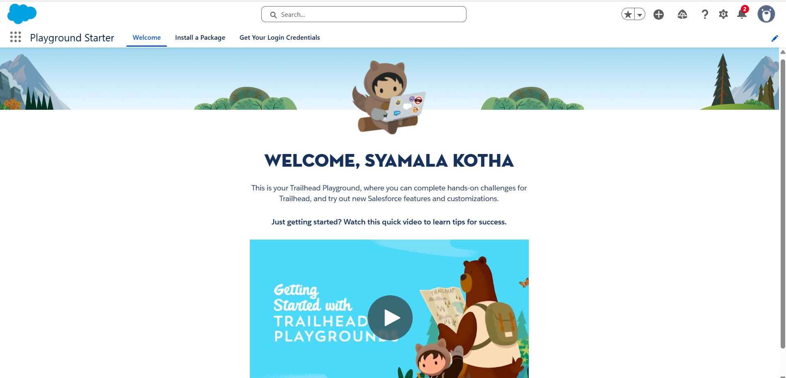
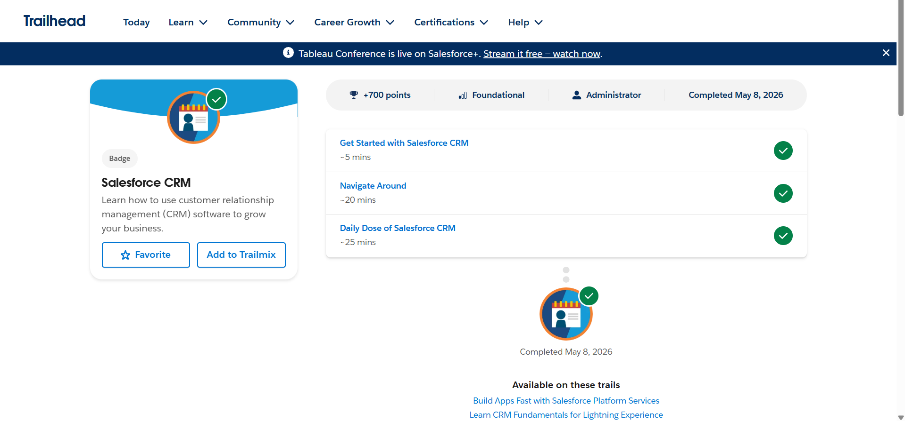
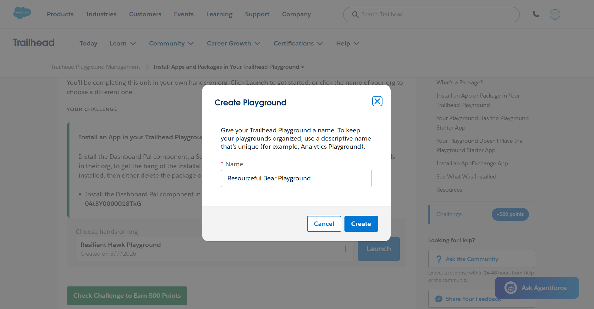
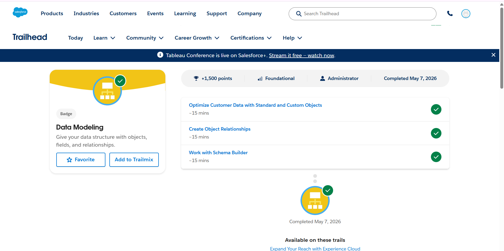

# Day 1 - CRM Basics

## 1. What is CRM?

CRM stands for **Customer Relationship Management**.

It is a technology and strategy used by organizations to manage interactions with customers and maintain strong business relationships. CRM systems help businesses store customer information, track communication, manage sales activities, and improve customer satisfaction.

A CRM platform centralizes all customer-related information in one place, making it easier for teams such as sales, marketing, and support to work efficiently.

### Benefits of CRM
- Improves customer relationships
- Increases sales productivity
- Organizes customer data
- Enhances communication
- Provides better customer support
- Helps in business growth

---

# 2. Why Companies Use Salesforce

Salesforce is one of the leading cloud-based CRM platforms used worldwide. Companies use Salesforce because it helps automate business processes and efficiently manage customer data.

## Reasons for Using Salesforce

### Centralized Data Management
Salesforce stores all customer and business information in a single platform.

### Automation
It automates repetitive tasks such as:
- Sending emails
- Follow-ups
- Workflow approvals
- Notifications

### Sales Tracking
Companies can track leads, opportunities, and sales performance in real time.

### Reporting and Analytics
Salesforce provides dashboards and reports that help organizations make data-driven decisions.

### Cloud-Based Platform
Users can access Salesforce from anywhere using the internet.

### Security and Scalability
Salesforce provides secure data storage and can be customized according to business needs.

---

# 3. Salesforce Standard Objects

Salesforce stores information using objects. Standard objects are pre-built objects provided by Salesforce to manage common business operations.

---

## Account Object

An **Account** represents a company, organization, institution, or business entity with which an organization has a relationship.

### Purpose of Account
- Store organization details
- Manage business relationships
- Maintain customer/company information

### Example Information Stored
- Organization Name
- Phone Number
- Address
- Industry Type

---

## Contact Object

A **Contact** represents an individual person associated with an Account.

Contacts usually contain personal and communication details of people connected to an organization.

### Purpose of Contact
- Store personal details
- Track communication
- Maintain relationships with individuals

### Example Information Stored
- Name
- Email
- Phone Number
- Designation

---

## Opportunity Object

An **Opportunity** represents a potential business deal or sales transaction.

It helps organizations track sales progress and manage revenue opportunities.

### Purpose of Opportunity
- Track potential deals
- Monitor sales stages
- Estimate revenue

### Opportunity Stages
- Qualification
- Proposal
- Negotiation
- Closed Won
- Closed Lost

---

# Real-World Mapping – College Admission System

| Salesforce Object | College Management Example |
|-------------------|----------------------------|
| Lead | Student interested in admission |
| Account | Engineering College |
| Contact | Student |
| Opportunity | Student admission process |

---

# Explanation

- **Lead** → Student showing interest in joining the college.
- **Account** → Engineering college or institution.
- **Contact** → Student associated with the college.
- **Opportunity** → Admission process from application to confirmation.
# Business Workflow – College Admission System

## Lead → Contact → Opportunity → Customer

### Lead
A student shows interest in joining the college by filling out an inquiry or admission form.

### Contact
The student’s details are verified and stored in the system.

### Opportunity
The student admission process is tracked, including application review and fee payment.

### Customer
The student successfully completes admission and becomes an official student of the college.
## Screenshots

### Trailhead Module Completion

### Salesforce Playground

### CRM Module Completion

### Playground Setup

### Platform basics

### Data Model Basics

