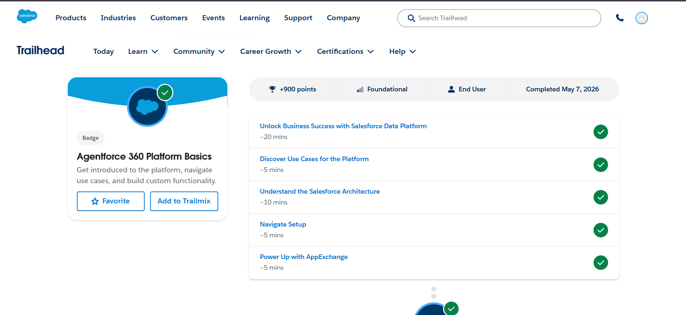
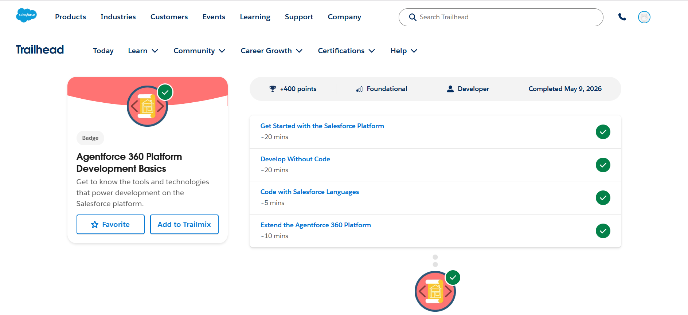

# Day 2 – Platform Basics

# 1. What is Salesforce Platform?

Salesforce Platform is a cloud-based application development platform that enables organizations to build, customize, and manage business applications efficiently. It provides tools for customer relationship management (CRM), automation, data management, analytics, and application development without requiring extensive hardware infrastructure.

---

# 2. Explain the Following Concepts

## App
An App in Salesforce is a collection of related tabs, objects, processes, and functionalities designed to support specific business operations. Apps help users access required features from a single interface.

## Object
An Object is a database structure in Salesforce used to store and organize business data. Standard objects such as Account, Contact, and Opportunity are provided by Salesforce, while custom objects can be created based on organizational requirements.

## Tab
A Tab is a user interface element that allows users to access objects, records, dashboards, reports, and applications easily within Salesforce.

---

# 3. Difference Between Configuration and Coding

| Configuration | Coding |
|---------------|---------|
| Uses declarative tools with minimal or no code | Uses programming languages such as Apex and Visualforce |
| Faster to implement and easier to maintain | Provides greater flexibility for complex requirements |
| Suitable for standard business processes | Suitable for advanced custom functionality |
| Examples: Flow Builder, Validation Rules | Examples: Apex Triggers, Lightning Components |

---

# 4. System Design – College Admission Management System

## App Name
College Admission Management System

## Objects
- Student
- Admission
- Course
- Faculty

## User Interaction
Students can register and submit admission applications through the system. Administrators can review applications, manage course allocations, and update admission statuses. Faculty members can access student information and manage academic-related activities efficiently using the Salesforce platform.

---

## Screenshots

### Agentforce 360 Platform Basics

### Agentforce 360 Platform Development Basics

