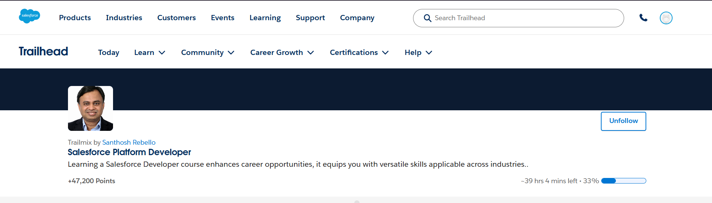

# Light Completion Day

## Modules Completed

1. Search Solution Basics
2. Agentforce 360 Platform Events Basics
3. Command-Line Interface (CLI)

---

# 1. CLI Reflection

Developers prefer command-line tools because they help perform tasks faster and more efficiently than clicking multiple buttons. Using CLI, developers can automate repetitive tasks, create projects quickly, install packages, manage files, and deploy applications with simple commands. CLI tools also improve productivity and are very useful for scripting and large-scale development workflows.

---

# 2. Search Reflection

Fast and accurate search is important in enterprise systems because organizations store huge amounts of data such as customer details, products, files, and support articles. Efficient search helps users quickly find the correct information, improves productivity, saves time, and enhances customer satisfaction. Poor search performance can slow down business operations and make systems difficult to use.

---

# 3. Platform Event Thinking

## Real-Life Example: Payment Completed System

When a customer completes a payment online, one action should automatically notify multiple systems and users.

### Automatic Notifications:
- Customer receives payment confirmation email
- Billing system updates payment status
- Inventory system updates product stock
- Shipping system starts delivery process
- Admin dashboard receives transaction notification

This is an example of event-driven architecture where one event triggers multiple systems automatically.

---

# One Learning from Each Module

| Module | One Learning |
|---|---|
| Search Solution Basics | Learned how SOSL helps search across multiple objects efficiently |
| Agentforce 360 Platform Events Basics | Learned how platform events enable communication between systems in real time |
| Command-Line Interface (CLI) | Learned how commands, flags, and arguments work in the terminal |

---


# Screenshot of Trailhead Progress

## Trailhead Progress

```md

